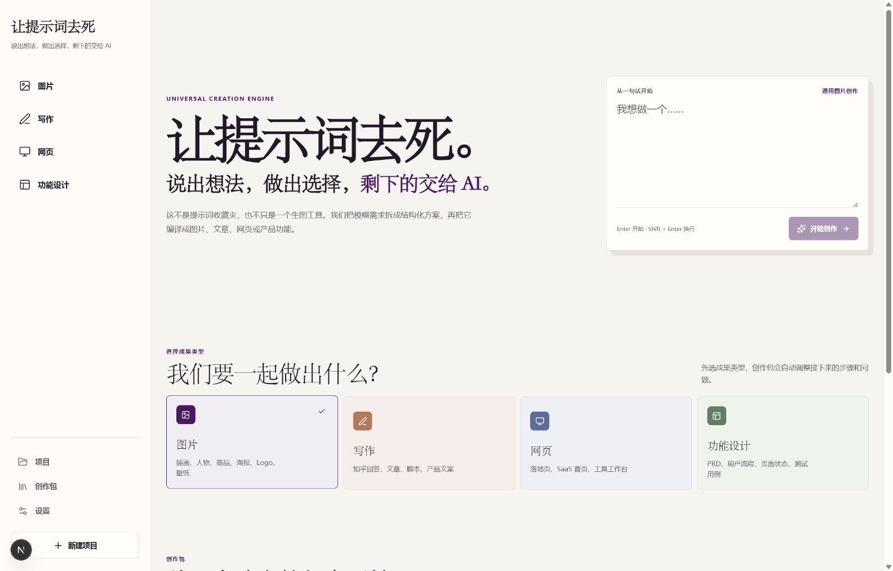

# Kill the Prompt

[](LICENSE)
[](https://nextjs.org/)
[](https://www.typescriptlang.org/)

English | [中文](README.md)

> Turn a rough idea into a structured plan, make the decisions that matter, and let AI handle the execution details.

Kill the Prompt is an open-source universal AI creation workbench. It converts vague requests into structured alternatives and a validated `ArtifactSpec`, then compiles the result into an image, Markdown document, safe web preview, or product requirements document.

The project evolved from the original AI Logo Decision Funnel. The legacy logo workflow remains available, while logo creation is also included as the built-in `image.logo` creation pack.



## Quick Start

Requirements: Node.js 20.9 or newer and npm 10 or newer.

```bash
git clone https://github.com/CraLy1245/kill-the-prompt.git
cd kill-the-prompt
npm install
npm run dev
```

Open `http://localhost:3000`. Then visit `http://localhost:3000/settings`, enter an OpenAI-compatible endpoint and API key, discover the available models, and select the analysis, execution, and optional image models.

The settings page stores credentials only in the ignored local data directory. Environment variables remain available for deployment and advanced local setups:

```powershell
Copy-Item .env.local.example .env.local
```

## Creation Flow

```text
Rough request
  -> intent analysis
  -> multiple directions
  -> high-leverage user decisions
  -> validated ArtifactSpec
  -> AI-generated HTML plan with safe preview
  -> artifact compiler
  -> image / Markdown / HTML / PRD
  -> validated patches for further edits
```

Prompts, model instructions, document structures, and web constraints are internal compilation details. Users work with goals, choices, and previews rather than raw prompt templates or generated source code.

## Supported Artifacts

| Kind | Initial output | Compiler |
| --- | --- | --- |
| `image` | Image instructions and generated assets | `ImageArtifactCompiler` |
| `writing` | Markdown content | `WritingArtifactCompiler` |
| `web-page` | `WebPageSpec`, HTML, CSS, and limited JavaScript | `WebPageArtifactCompiler` |
| `product-feature` | PRD Markdown and structured feature JSON | `ProductFeatureArtifactCompiler` |

Built-in creation packs:

- `image.general`: general image creation
- `image.logo`: logo design
- `writing.zhihu-answer`: structured long-form answers
- `web.saas-landing-page`: SaaS landing pages
- `feature.app-feature`: app feature design

Creation packs are declarative JSON. They cannot load JavaScript, shell commands, React components, dynamic imports, or arbitrary Node.js modules.

## Architecture

- `src/core/types` and `src/types`: shared artifact, pack, canvas, result, and patch contracts
- `src/core/schemas.ts`: independent Zod schemas for packs and all artifact types
- `src/core/flow-engine.ts`: dynamic steps, ordering, rollback, and decision applicability
- `src/core/pack-registry`: built-in and custom pack registration
- `src/core/model-providers`: OpenAI-compatible analysis and execution providers
- `src/core/compilers`: artifact-specific compilers
- `src/core/storage`: storage abstraction and file-backed local persistence
- `src/components/universal`: the workbench, dynamic fields, artifact previews, and safe iframe UI

## Local Data

Runtime data is stored transparently under `.local-data/`:

```text
.local-data/
|-- custom-packs/
|-- projects/
|   `-- project-id/
|       |-- project.json
|       |-- spec.json
|       |-- revisions.json
|       |-- assets/
|       `-- outputs/result.json
`-- cache/
```

The directory is ignored by Git. Back it up separately if you need to preserve local projects.

## Security Boundaries

- Model-generated plan pages pass server-side allowlist validation before rendering.
- Plan previews reject scripts, event handlers, external resources, nested pages, network requests, and dynamic code execution.
- Web artifact previews run in a sandboxed iframe with a strict CSP and no same-origin access.
- Custom packs are data-only JSON and can only reference registered fields, steps, compilers, renderers, and exporters.
- API keys are never returned by public status endpoints and local settings are ignored by Git.

Production deployments should use a controlled server-side secret store instead of the local settings file.

## Development

```bash
npm test
npm run typecheck
npm run build
```

The model layer uses two business roles:

- `analysis`: requirement analysis, directions, decisions, `ArtifactSpec` construction, and patch parsing
- `execution`: generation of writing, web pages, product documents, and images from a confirmed spec

The universal workflow does not silently fall back to demo output when a required model is missing.

## Current Limitations

- Custom creation packs can be imported and exported through validated JSON APIs, but the visual editor is still in progress.
- Project archive export and complete historical rollback remain future work.
- Additional staging contract tests and fixed regression fixtures are recommended before production deployment.

## License

[MIT](LICENSE)
